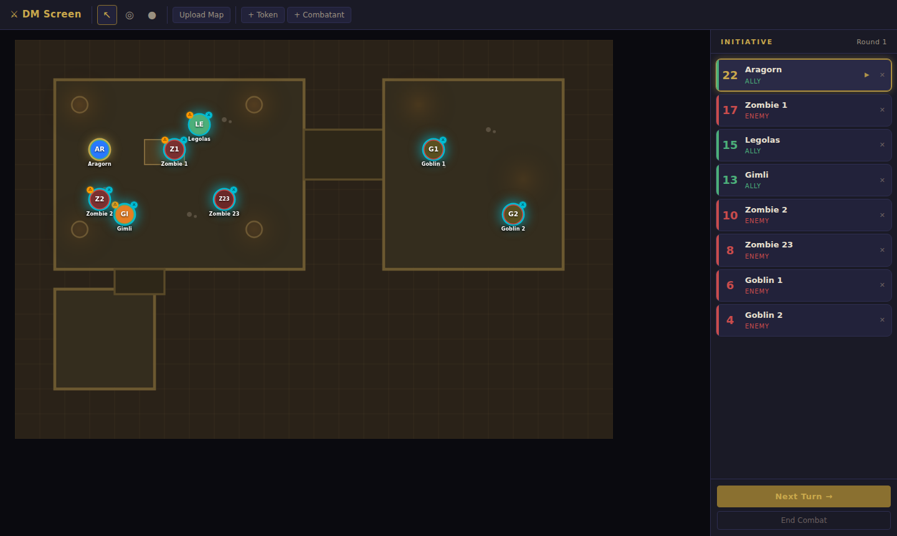
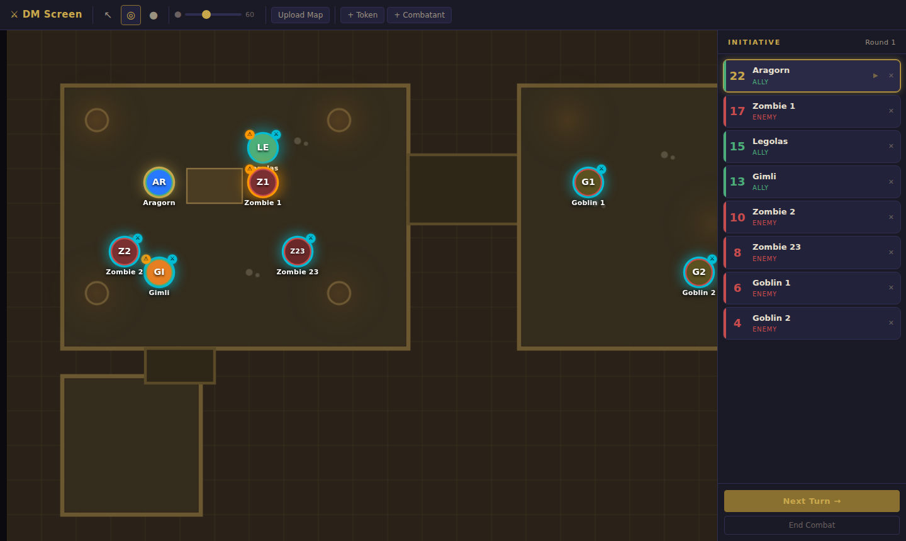
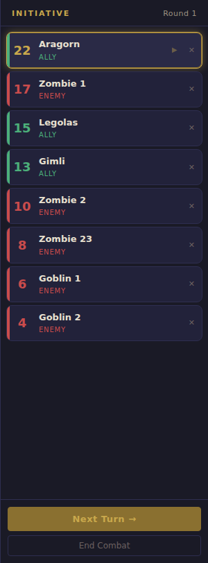

# DM Screen — D&D Session Manager

A web application for game masters to run Dungeons & Dragons sessions. Built with React, TypeScript, and Vite.



## Features

### Map View
Upload any image as a battle map. Zoom with the mouse wheel and pan by holding Space and dragging (or middle-click drag).

### Fog of War
Paint fog over the map to hide unexplored areas from players. Use the reveal brush to uncover areas as the party explores. Fog has soft feathered edges for a natural look and persists across page refreshes.



### Tokens
Add draggable tokens for players and enemies. Each token shows the character's initials (e.g. `Z1`, `Z23`, `GA`) and their full name as a label below. Tokens snap to the map grid when dropped. Right-click a token to remove it.

- **Allies** — green-accented ring
- **Enemies** — red-accented ring
- **Active turn** — gold pulsing ring

### Flanking Detection
Tokens automatically detect flanking: when two tokens on the same side bracket an enemy on opposite sides (angle ≥ 120°), all three are highlighted in real time as you drag tokens around the map.

- **Cyan ⚔ ring** — this token is flanking (has advantage on attacks)
- **Orange ⚠ ring** — this token is being flanked (opponents have advantage)

### Initiative Tracker
A BG3-style sidebar tracking turn order for combat. Add combatants with a name, initiative roll, and optional link to a map token. The active combatant's linked token gets a gold glow on the map.



- Sorted highest-to-lowest initiative
- Round counter
- Green strip = ally, red strip = enemy
- Active turn highlighted in gold with animated indicator

## Getting Started

```bash
npm install
npm run dev
```

Then open `http://localhost:5173` in your browser.

## Keyboard Shortcuts

| Key | Action |
|-----|--------|
| `P` | Pointer tool |
| `R` | Fog reveal brush |
| `H` | Fog hide brush |
| `N` | Next turn (combat) |
| Scroll wheel | Zoom map |
| Space + drag | Pan map |

## Tech Stack

- **React 18** + **TypeScript** + **Vite**
- **Zustand** for state management
- **HTML5 Canvas** for fog of war
- Plain CSS with custom properties for the dark fantasy theme
- Session state persisted to `localStorage`
